# 狸猫日志售票系统

城乡客运/班线大巴售票系统全栈实现，包含微信小程序购票端、司机核销端、Web 管理后台和 Go 后端服务。

## 项目结构

| 目录 | 说明 |
|------|------|
| `limaorizhi-dingpiaoWX` | 微信小程序（乘客购票 + 司机核销 + 运营管理） |
| `limaorizhi-dingpiaoHD/limaorizhi-admin` | Web 管理后台（Vue 3 + Element Plus） |
| `limaorizhi-dingpiaoHD/limaorizhi-server` | 后端服务（Go + Gin + GORM） |

## 功能特性

- **在线购票**：班次查询、区间座位实时容量、座位选择、无座票配额
- **微信支付**：APIv3 原生对接（验签、防重放、AES-GCM 解密、公钥模式、mTLS 退款），查单对账三层兜底
- **退改签**：改签差价只降不升、原金额退款防退费校验冲突、优惠券自动归还
- **司机核销**：扫码验票（HMAC 签名凭证防伪）、发车/到达状态流转、班次轨迹上报
- **实名认证**：身份证二要素核验（AES-GCM 加密存储，云市场 API 降级策略）
- **营销体系**：优惠券、积分、任务奖励
- **AI 数字员工**：管理后台内嵌 AI 助手（SSE 流式回复，上下文来自真实业务数据并脱敏）
- **订阅消息**：支付成功/发车/到达/退款全链路微信订阅通知（配额制防滥用）

## 界面预览

### 乘客端

| 乘客端 | 乘客端 |
|--------|--------|
| 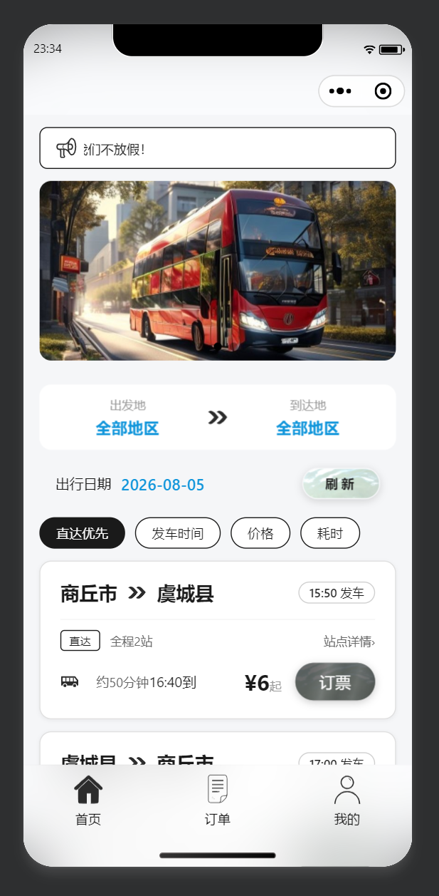 | 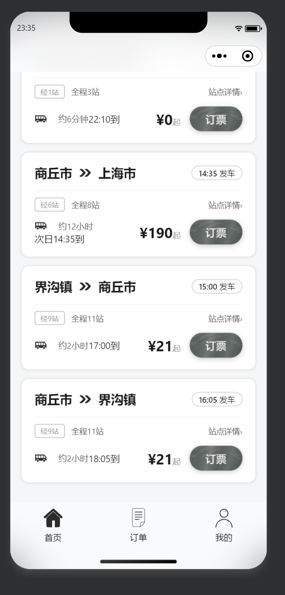 |
| 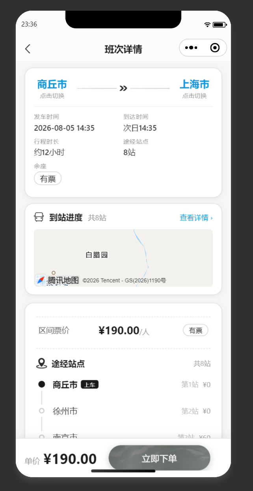 | 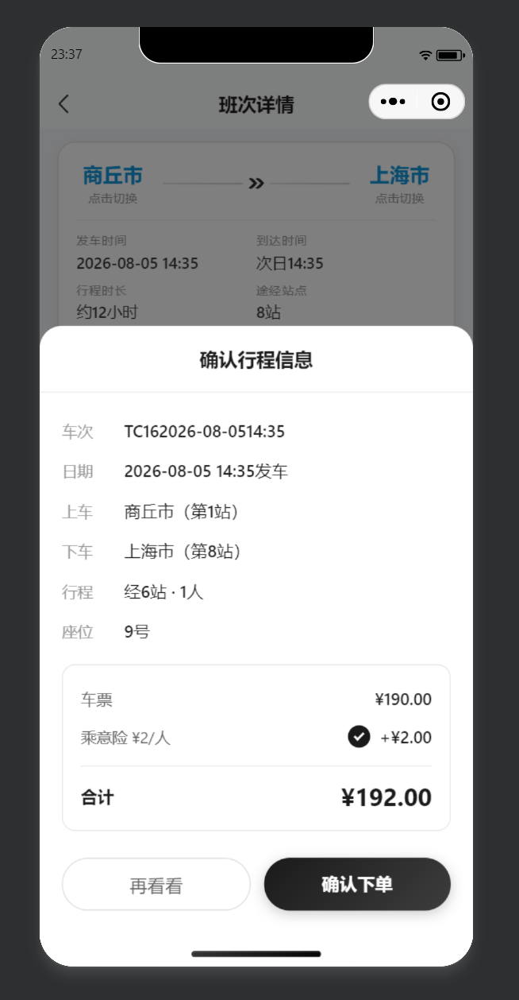 |
| 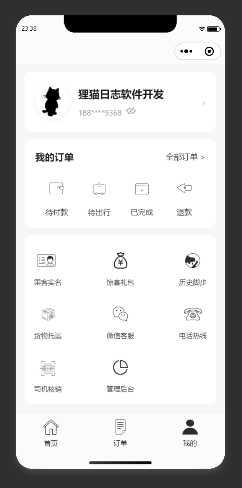 | 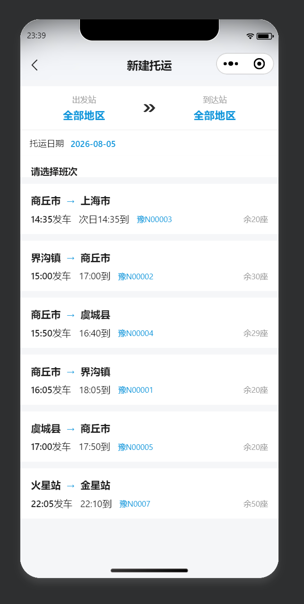 |

### 司机/管理后台

| 司机端 | 管理后台 |
|--------|----------|
| 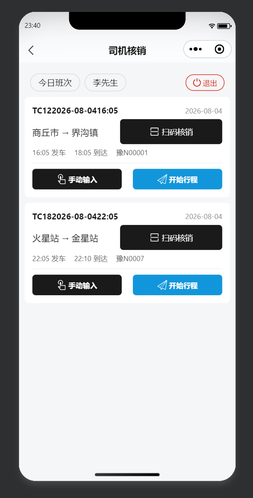 | 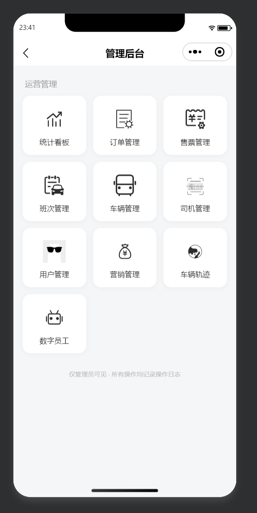 |
| 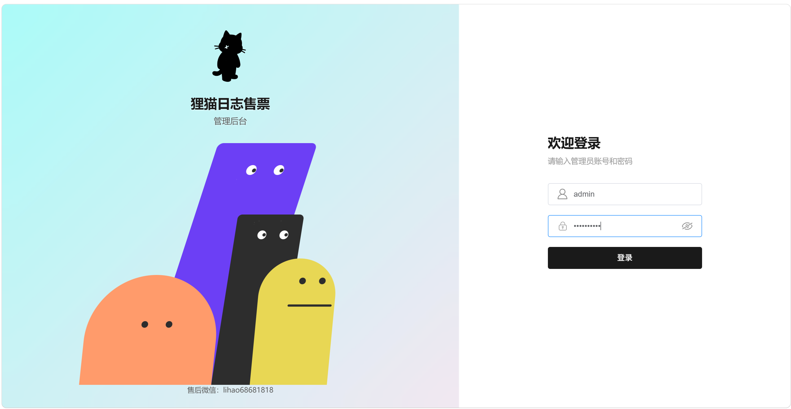 |  |
| 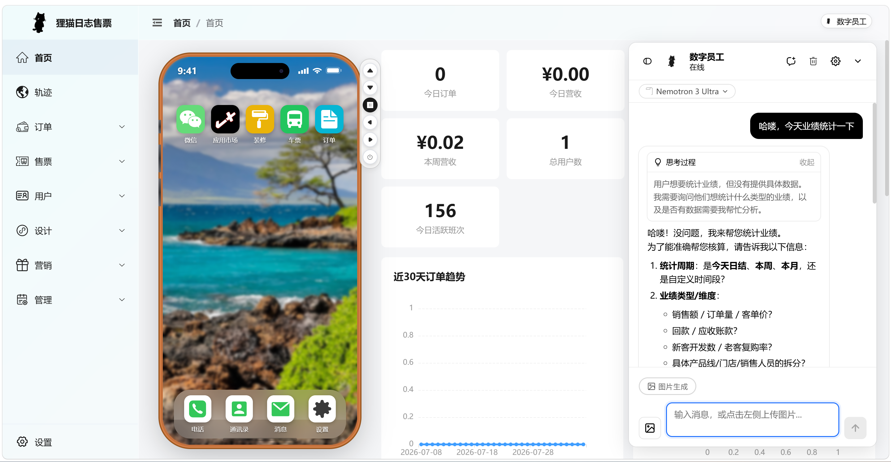 | 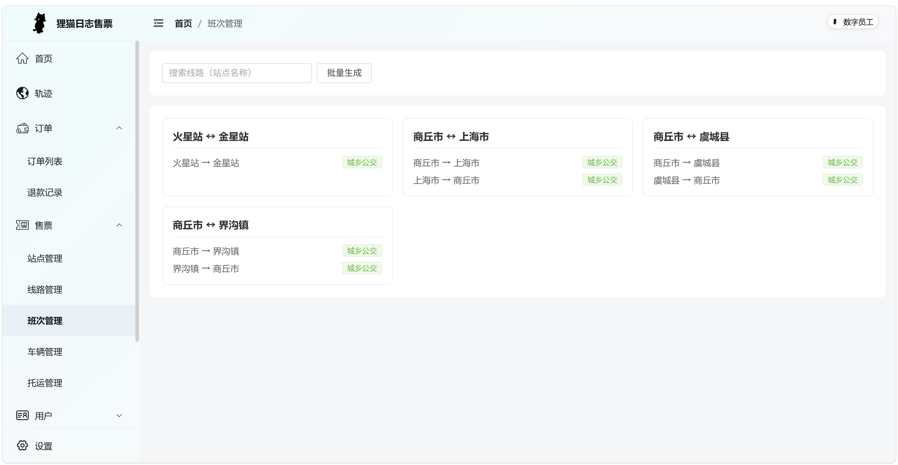 |
| 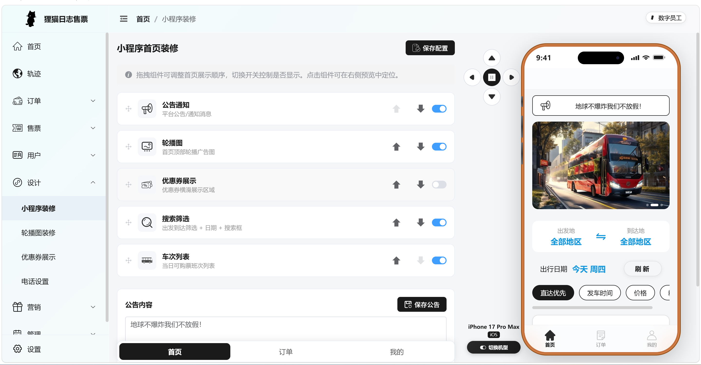 | 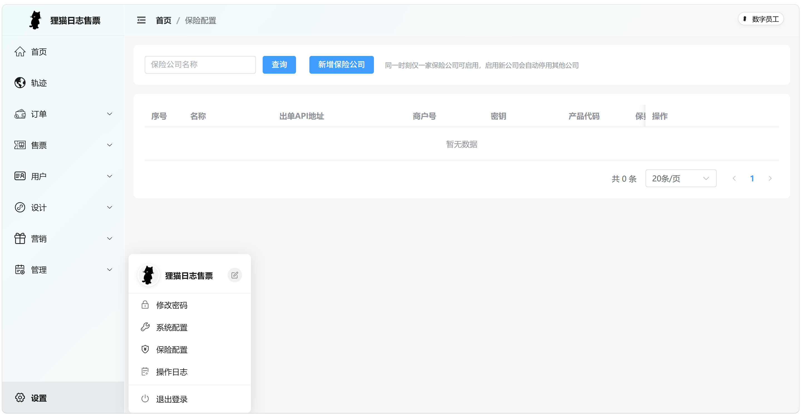 |

## 技术栈

- **后端**：Go 1.21+ / Gin / GORM / MySQL / Redis
- **管理后台**：Vue 3 / Vite / Element Plus / Pinia
- **小程序**：微信小程序原生

## 快速开始

### 后端

```bash
cd limaorizhi-dingpiaoHD/limaorizhi-server
# 1. 准备 MySQL/Redis，执行 migrations/schema.sql 建表
# 2. 复制 config.yaml 为本地配置，密钥一律用环境变量注入（见文件内注释）
# 3. 启动
go run cmd/server/main.go
```

> 密钥/证书（微信支付证书、JWT 密钥、数据库密码等）**一律通过环境变量注入**，配置文件不落任何明文密钥，详见 `config.yaml` 内注释。

### 管理后台

```bash
cd limaorizhi-dingpiaoHD/limaorizhi-admin
npm install
npm run dev
```

### 微信小程序

用微信开发者工具打开 `limaorizhi-dingpiaoWX` 目录，按 `config.js` 内注释配置后端地址。

## 安全设计

- 登录：弱口令黑名单 + 连续失败 5 次锁定 15 分钟 + 滑动验证码
- 订单：行锁防超卖、支付回调幂等、退款幂等、查单对账兜底
- 数据：身份证加密存储、接口输出脱敏、AI 上下文脱敏
- 上传：扩展名白名单 + magic bytes 校验

## 许可证

MIT License
